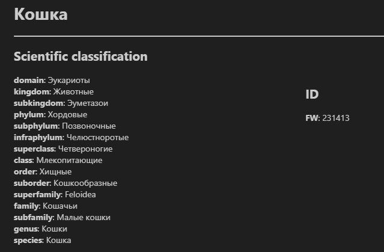

<div align="center"></div>

<h1 align="center"> ZooPy: A Python Library for Animal Data Analysis</h1>

<p align="center">
    </a>
    </a>
</p>

## Overview
**ZooPy** is a simple Python library with a concise API designed for analyzing and processing biological data related to animals. It provides tools for working with datasets, performing image recognition etc.
<div align="center"></div>

## Data
The data was collected from [Wikipedia](https://www.wikipedia.org/) and contains the languages:
- 🇷🇺 Russian

## Library Structure
<div align="center"></div>

## Installation
To install ZooPy, run:

```bash
pip install zoopy
```

Also install the NLP model for Spacy

- Russian (40 MB):
```python -m spacy download ru_core_news_md```

## Usage
Getting started:

```python
from zoopy import animal

cat = animal.Animal('кошка', 'ru')
cat.display()
```

<div align="center"></div>


ZooPy has several pre-trained models

```python
import cv2
from zoopy import models

model = models.ImageClassification()

img = cv2.imread('turtle.jpeg')
model.predict(img)
```

For more information see [docs](docs/).

## Dependencies
- `pandas==2.2.3`

## Contact
Contact me by [Mail](nikitabakutov2008@gmail.com) or [Telegram](https://t.me/droyti).

## License
This project is licensed under the MIT License. See the [LICENSE](./LICENSE) file for details.